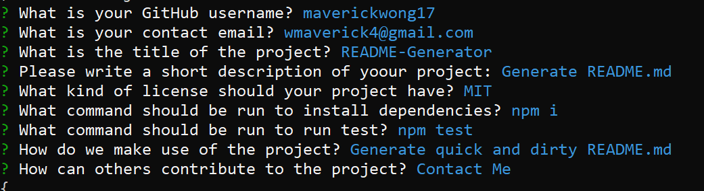

# readme-generator

## Description 

This is an application run through Node.js to generate a quick readme. This asks for user input through inquirer to answer some questions. It then takes the answers to the questions to another js file to run the generateMarkdown file, then use template literals to help fill in the readme guide.

## Table of Contents

* [Installation](#installation)
* [Usage](#usage)
* [Credits](#credits)
* [License](#license)


## Installation

Clone or fork repository, and install necessary dependencies. Run the following command in your terminal of choice:
```
npm install
```
 
## Usage 

To run the program, run the following command:
```
node index.js
```
User will then be prompted to answer the following questions:


Upon answering the last question, the file genReadme.md will be created with the answers in the appropriate sections.


[Video Example](https://www.youtube.com/watch?v=vYoZWv-XnQo)


## Credits

[Node.js](https://nodejs.org/dist/latest-v16.x/docs/api/)

[Inquirer](https://www.npmjs.com/package/inquirer)

[License Badges](https://gist.github.com/lukas-h/2a5d00690736b4c3a7ba)

## License

This project is licensed under the MIT license.  
[](https://opensource.org/licenses/MIT)


Created by [Maverick Wong](https://github.com/maverickwong17)